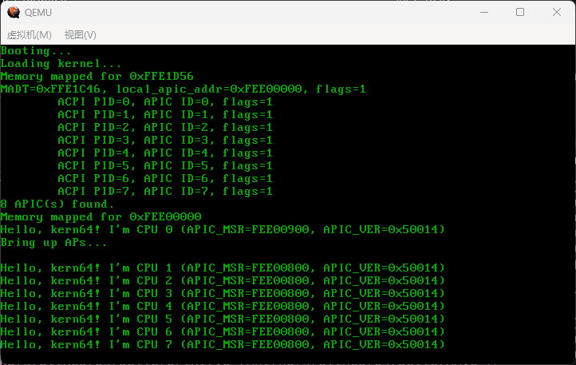

# Introduction

A minimal kernel demo with following features:

- x86_64
- APIC (Advanced Programmable Interrupt Controller)
- SMP support
- Self-contained (no other dependencies)

## HOWTO
    
1. Run command 'make'.
2. Insert the 'floppy.img' to a virtual machine software and boot!


## Run in QEMU
```
qemu-system-x86_64 -m 256 -fda floppy.img --smp cores=4,threads=2
```

## Screenshot

